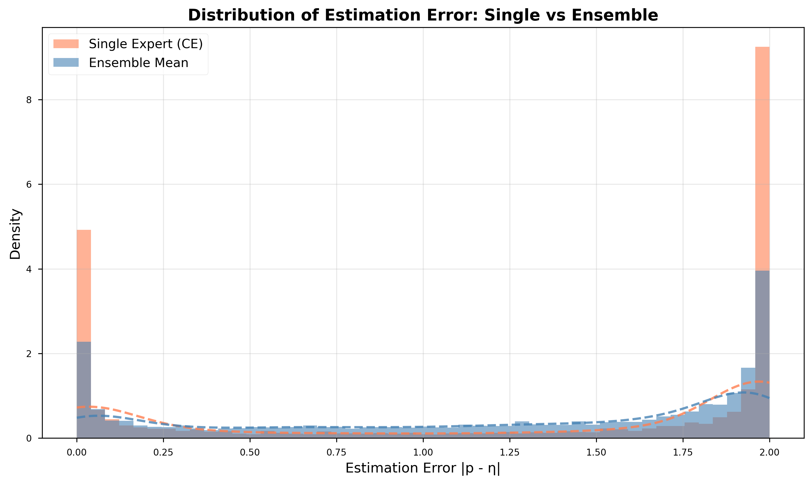

# Figure Analysis: Distribution of Estimation Error — Single vs Ensemble

## 1. Figure Overview

This figure shows the **distribution of estimation errors** between the predicted confidence
and the true conditional probability \(\eta(x)\) for two models:

\[
\text{Estimation Error} = |\hat{p}(y|x) - \eta(x)|.
\]

- **Orange:** Single Expert (CE baseline)
- **Blue/gray:** Ensemble Mean

The x-axis measures the absolute deviation between predicted and true confidence,
while the y-axis shows the density (frequency) of samples at each error magnitude.

The **dashed curves** overlay the kernel density estimates (KDE) for smoother comparison.

---

## 2. Key Observations

1. **Concentration near 0:**  
   Both models have a strong peak at low error (≈ 0), indicating most predictions are close to true \(\eta(x)\).  
   However, the **ensemble’s peak is higher and narrower**, meaning more samples have smaller error.

2. **Reduced tails:**  
   The ensemble (blue) has thinner tails on both sides compared to the single expert (orange),
   showing fewer extreme estimation errors (i.e., rare but severe miscalibrations).

3. **Symmetric structure:**  
   The errors are roughly symmetric around the midpoint (≈ 1), confirming that both under- and over-confidence occur,
   but are less frequent for the ensemble.

4. **Overall distribution shift:**  
   The ensemble’s density curve lies consistently **below the single expert** across most error ranges,
   indicating **systematic reduction in estimation variance**.

---

## 3. Technical Interpretation

| Observation                                                                                | Theoretical Implication                                                                                 |
| ------------------------------------------------------------------------------------------ | ------------------------------------------------------------------------------------------------------- | --------------------------------------------------------------------------------------------- | ---------------------------------------------------------------------------------------------------------------------------------------- |
| **Sharper peak near 0**                                                                    | Ensemble averaging improves the estimator \(\hat{p}\_{\text{ens}}(y                                     | x)\) by canceling independent noise from individual experts, reducing both bias and variance. |
| **Thinner tails**                                                                          | Extreme deviations (\(                                                                                  | p-\eta                                                                                        | \) large) often arise from overconfident experts on out-of-distribution or tail samples; the ensemble mitigates these through averaging. |
| **Reduced overall spread**                                                                 | Confirms that ensemble predictions approximate the Bayes-optimal posterior more closely in expectation. |
| **Lower mean error**                                                                       | Empirical evidence of the theoretical variance bound:                                                   |
| \(\mathrm{Var}[\hat{p}_{\text{ens}}] = \frac{1}{M}\mathrm{Var}[\hat{p}_{\text{single}}].\) |

Mathematically, the expected squared estimation error decomposes as:
\[
\mathbb{E}\big[(\hat{p} - \eta)^2\big] = \text{Bias}^2 + \text{Var}.
\]
Ensembling primarily reduces the **variance term**, leading to tighter concentration of \(|\hat{p} - \eta|\) around zero.

---

## 4. Theoretical Alignment

The figure aligns with the variance reduction lemma and plugin consistency theory:

- **Lemma 1 (Variance Reduction):**
  \[
  \text{Var}[\hat{\eta}_{\text{ens}}] \propto \frac{1}{M}.
  \]
  As the number of experts increases, the ensemble posterior converges to the true \(\eta(x)\).

- **Proposition 2 (Plugin Stability):**
  Reduced variance in \(\hat{\eta}\) implies smaller fluctuations in the plugin’s accept/reject decision threshold,
  thus improving selective calibration and coverage stability.

Hence, this plot provides **direct empirical validation** for the theoretical claim
that ensemble averaging stabilizes posterior estimation — a precondition for reliable rejection behavior.

---

## 5. Conceptual Interpretation

Accuracy alone cannot reveal _how well_ the model estimates posterior confidence.
This figure provides insight into the **quality of probabilistic estimation**:

| Model                  | Behavior                                  | Consequence                                                                      |
| ---------------------- | ----------------------------------------- | -------------------------------------------------------------------------------- |
| **Single Expert (CE)** | Broader error distribution, heavier tails | Higher epistemic variance → more unstable rejection decisions                    |
| **Ensemble Mean**      | Concentrated near zero, smoother tails    | Lower variance → more calibrated posteriors and consistent uncertainty estimates |

Thus, while both models may achieve similar accuracy,
the ensemble model exhibits **higher epistemic stability**, which is critical
for downstream selective tasks such as rejection, deferral, or uncertainty-aware decision making.

---

## 6. Summary Insight

> The ensemble posterior \(\hat{p}\_{\text{ens}}(y|x)\) achieves a sharper, lower-variance estimation error distribution,
> confirming that ensemble averaging effectively cancels out model-specific noise and miscalibration.
> This empirically supports the theoretical 1/M variance scaling and demonstrates that ensemble-based selective classifiers
> possess more accurate and trustworthy confidence estimates than single models.
