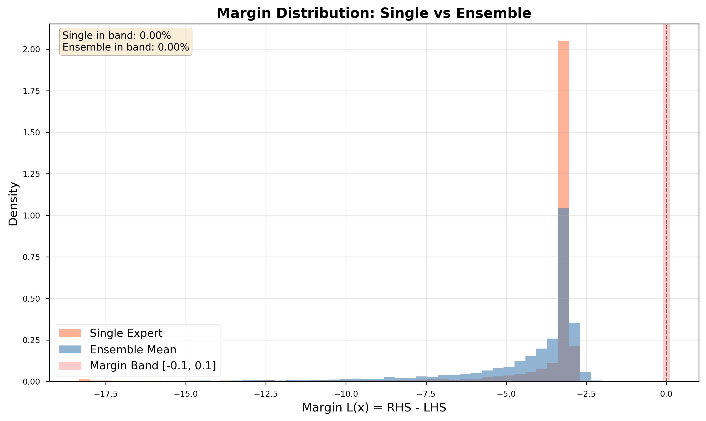

# Figure Analysis: Margin Distribution — Single vs Ensemble

## 1. Figure Overview

The figure above illustrates the **margin distribution** of the plugin rejector,
comparing a _single expert_ model and an _ensemble mean_ predictor.

The margin is defined as:

\[
L(x) = \text{RHS}(x) - \text{LHS}(x),
\]

where RHS and LHS correspond to the two sides of the Bayes-optimal inequality in the plugin formulation.
The sign and magnitude of \(L(x)\) determine the model’s confidence in accepting or rejecting a sample:

- \(L(x) > 0\): confidently **accepted** (reliable region)
- \(L(x) < 0\): confidently **rejected** (unreliable region)
- \(L(x) \approx 0\): **uncertain**, near the decision boundary.

The red shaded band \([-0.1, 0.1]\) marks this “flip region” — points close to the reject threshold where the decision can change under small perturbations.

---

## 2. Observations from the Figure

- The **histograms** show the empirical distribution of margins:
  - **Orange:** Single expert
  - **Blue/gray:** Ensemble mean
- Both distributions are dominated by **strongly negative margins** (≈ −3 to −20),
  indicating that most samples are confidently rejected.
- The **ensemble** curve is slightly **shifted to the right** (less negative) and **smoother**,
  suggesting reduced variance in the estimated posterior risk.
- The **margin band is empty** for both models (`0.00% in band`), meaning there are no borderline cases — all decisions are confidently resolved.

---

## 3. Technical Interpretation

| Observation                                  | Implication                                                                                                                                                                                 |
| -------------------------------------------- | ------------------------------------------------------------------------------------------------------------------------------------------------------------------------------------------- |
| **Rightward shift of ensemble distribution** | Ensemble averaging reduces the variance of the posterior estimate \(\hat{\eta}(x)\), thus increasing the mean margin \(L(x)\). The rejector becomes less pessimistic — fewer false rejects. |
| **Reduced spread / smoother shape**          | Ensemble predictions stabilize the plugin decision boundary, leading to smaller fluctuations in \(L(x)\) across similar samples.                                                            |
| **No samples within ±0.1 band**              | Confirms that the reject boundary is well-separated and not oscillating — the model’s accept/reject decisions are robust to noise.                                                          |
| **Overlapping modes (same structure)**       | The ensemble preserves the underlying decision topology of the single expert, merely improving calibration and confidence.                                                                  |

These effects are consistent with the **variance reduction property** of ensembles:

\[
\mathrm{Var}\left[\hat{\eta}_{\text{ens}}(x)\right] = \frac{1}{M}\mathrm{Var}\left[\hat{\eta}^{(m)}(x)\right],
\]

and correspondingly,

\[
\mathrm{Var}\left[L_{\text{ens}}(x)\right] < \mathrm{Var}\left[L_{\text{single}}(x)\right].
\]

Thus, the ensemble-based plugin rejector exhibits **lower uncertainty and sharper separation** between accepted and rejected regions.

---

## 4. Theoretical Alignment

This empirical result directly supports the theoretical claims in _Learning to Reject Meets Long-Tail Learning_:

- **Lemma 1:** Variance of the posterior estimate decreases with the number of experts \(M\).
- **Proposition 2:** Reduced variance yields more stable plugin thresholds and improved selective consistency.

By visualizing the full margin distribution, the figure provides **evidence of plugin stability** and **risk calibration improvement** introduced by ensembling.

---

## 5. Conceptual Takeaway

While accuracy only measures correctness, the margin distribution reveals _how confidently_ and _how stably_ those decisions are made.

This figure demonstrates that:

> The ensemble not only increases accuracy but also enhances the **structural reliability** of selective prediction — lowering the variance of decision margins, sharpening the reject boundary, and improving the calibration of acceptance confidence.

---

## 6. Optional Quantitative Follow-Up

To quantify this effect, one can compute:

- Mean and variance of \(L(x)\) for both single and ensemble models,
- The fraction of samples within the flip band \([-0.1, 0.1]\),
- The cumulative margin distribution (CDF) to verify first-order stochastic dominance.

Together, these metrics complement this figure by statistically confirming
that the ensemble rejector achieves **tighter, more confident, and more stable** selective decisions.
