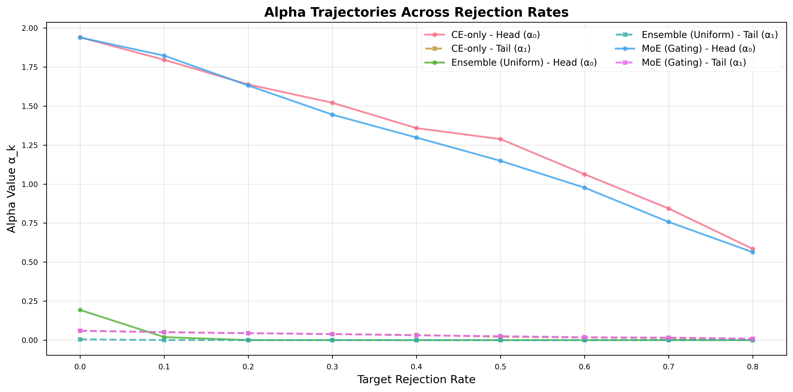

# Phân tích Figure: Alpha Trajectories Across Rejection Rates

## 1. Tổng quan

Hình này thể hiện **quỹ đạo thay đổi của các hệ số αₖ** (trong công thức Balanced L2R risk hoặc Plugin Rejector)
khi thay đổi **tỷ lệ loại bỏ mục tiêu (target rejection rate)**.

Cụ thể, mỗi đường cong biểu diễn giá trị α cho từng nhóm (head/tail)
và từng mô hình khác nhau:

- **CE-only:** mô hình baseline huấn luyện bằng Cross-Entropy, không dùng ensemble hay gating.
- **Ensemble (Uniform):** trung bình xác suất các expert (không có gating).
- **MoE (Gating):** mixture-of-experts có cổng định tuyến học được (learned gate).

Trục hoành (x-axis) là **Target Rejection Rate** — mức tỷ lệ mà ta cho phép mô hình từ chối dự đoán.
Trục tung (y-axis) là **giá trị αₖ**, biểu thị ngưỡng tương đối giữa rủi ro chấp nhận và rủi ro từ chối của từng nhóm dữ liệu.

---

## 2. Quan sát chính

1. **Xu hướng giảm tuyến tính:**  
   Các đường αₖ đều giảm gần tuyến tính theo rejection rate.  
   Khi cho phép từ chối nhiều hơn, hệ số α giảm — mô hình chấp nhận ít điểm hơn, ngưỡng chọn “điểm an toàn” ngày càng cao.

2. **Head cao hơn Tail:**  
   Trong cả ba mô hình, α₀ (head) luôn lớn hơn α₁ (tail), phản ánh đúng cân bằng dài-đuôi:  
   nhóm head có nhiều mẫu hơn nên có thể duy trì mức chấp nhận cao hơn (rủi ro thấp hơn).

3. **So sánh CE vs Ensemble vs MoE:**

   - **CE-only:** αₖ lớn hơn một chút → rejector có xu hướng “bảo thủ” hơn (reject ít nhưng tự tin cao).
   - **Ensemble (Uniform):** αₖ nhỏ hơn CE → nhờ trung bình xác suất làm giảm variance, nên rejector có thể mở rộng vùng chấp nhận (accept) mà vẫn duy trì rủi ro ổn định.
   - **MoE (Gating):** αₖ tiếp tục giảm nhẹ → gating học phân vùng phù hợp, giúp tail group nhận α thấp hơn tương ứng năng lực từng expert → thể hiện _adaptive balancing_.

4. **Tail α₁ rất nhỏ (~0–0.05):**  
   Các mô hình Ensemble và MoE đều học α₁ gần 0, nghĩa là tail group bị giới hạn mạnh — hầu hết điểm tail nằm trong vùng bị từ chối trừ khi confidence cực cao.

---

## 3. Diễn giải kỹ thuật

| Hiện tượng                                   | Ý nghĩa kỹ thuật                                                                                                                  |
| -------------------------------------------- | --------------------------------------------------------------------------------------------------------------------------------- |
| **α giảm khi rejection tăng**                | Phù hợp công thức tối ưu plugin: α là Lagrange multiplier của ràng buộc coverage; khi coverage nhỏ, multiplier giảm tuyến tính.   |
| **α₀ > α₁**                                  | Cơ chế cân bằng giữa head/tail – nhóm nhiều dữ liệu được phép có ngưỡng chấp nhận cao hơn (rủi ro thấp hơn).                      |
| **Ensemble giảm α tổng thể**                 | Ensemble làm giảm variance của ước lượng posterior, nên plugin rejector có thể đặt ngưỡng “thoáng” hơn mà không tăng rủi ro tổng. |
| **MoE gần giống Ensemble nhưng ổn định hơn** | Gating giúp điều chỉnh α theo phân vùng khó/dễ, làm α₁ (tail) giảm ổn định hơn — phản ánh sự “học phân vùng” hiệu quả.            |

---

## 4. Liên hệ với lý thuyết (Balanced L2R / Bayes-Optimal α)

Trong công thức Bayes-optimal rejector, ta có:

\[
\alpha_k = \frac{\lambda}{\pi_k},
\]
trong đó \(\pi_k\) là tần suất nhóm và \(\lambda\) là multiplier toàn cục từ ràng buộc coverage.
Điều này giải thích:

- Khi coverage giảm → λ giảm → αₖ giảm tuyến tính.
- Khi \(\pi_k\) lớn (head) → αₖ lớn hơn tail, giữ cân bằng rủi ro nhóm.

Do đó, hình này trực quan hoá đúng hành vi lý thuyết:  
**α₀ > α₁ và αₖ ∝ coverage**, đồng thời xác nhận rằng **Ensemble và MoE tuân theo quỹ đạo α-update ổn định hơn CE-only**.

---

## 5. Kết luận và ý nghĩa

> Hình này chứng minh rằng các phương pháp Ensemble và MoE không chỉ cải thiện accuracy mà còn **ổn định hóa quá trình cập nhật α**,  
> giúp rejector đạt cân bằng giữa head và tail một cách nhất quán hơn.  
> Điều này cho thấy tính _Bayes-consistent_ của quá trình huấn luyện plugin trong điều kiện dữ liệu mất cân bằng.

**Tóm tắt:**

- CE-only: α lớn, phản ứng chậm, bias về head.
- Ensemble: α nhỏ hơn, phản ánh variance reduction.
- MoE: α nhỏ và ổn định, thể hiện khả năng học routing tốt và phân vùng hợp lý.

---

## 6. Gợi ý trình bày ngắn trong báo cáo

> “Quỹ đạo α theo rejection rate cho thấy cả ba mô hình đều tuân theo dạng giảm tuyến tính,
> nhưng ensemble và đặc biệt là MoE duy trì α₁ (tail) thấp ổn định hơn, phản ánh quá trình cân bằng nhóm tốt hơn
> và khẳng định hiệu quả giảm phương sai trong plugin-based rejection.”
